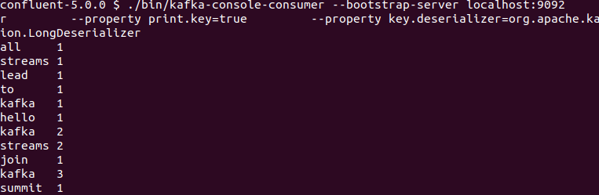
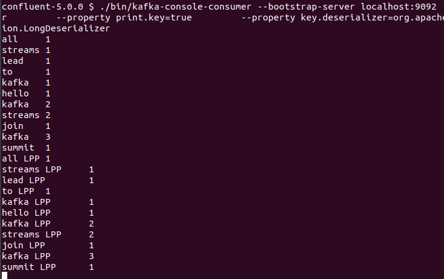
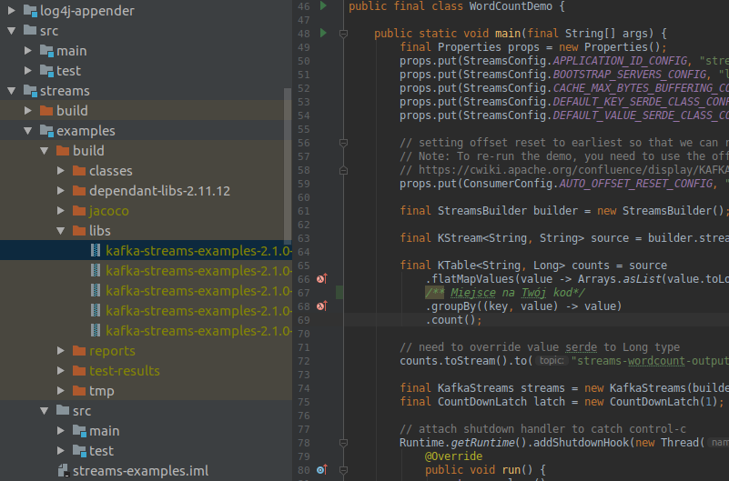

**Cel**

Twoim zadaniem jest napisanie i uruchomienie klasy Java która oparta jest o Kafka Streams API.

**Opis**

Przeczytaj wpis na blogu Confluent [Creating a Streaming Data Pipeline](https://docs.confluent.io/current/streams/quickstart.html)
Po wykonaniu wszystkich kroków w tutorialu otrzymasz:

**Zadanie**

Zmodyfikuj kod klasy [WordCountDemo.java](https://github.com/apache/kafka/blob/2.0/streams/examples/src/main/java/org/apache/kafka/streams/examples/wordcount/WordCountDemo.java) tak, aby w łańcuchu przetwarzania zmiennej `source` następowała podmiana słów na słowo+" LPP". W rezultacie aplikacja powinna wyświetlić:

**Wskazówki**

Aby  wykonać zadanie możesz ściągnąć kody źródłowe Apache Kafka, które zawierają klasę WordCountDemo.java. Zmiena w kodzie może ograniczyć się do odpowiedniego użycia metody [KStream.map()](https://github.com/apache/kafka/blob/2.0/streams/src/main/java/org/apache/kafka/streams/kstream/KStream.java#L151). Ważne aby po zbudowaniu JAR'a z nową klasą zastąpić poprzedni JAR na CLASSPATH używanym w skrypcie `bin/kafka-run-class`. Napewno warto wciągnąć kod do IDE np. IntelliJ IDEA:

