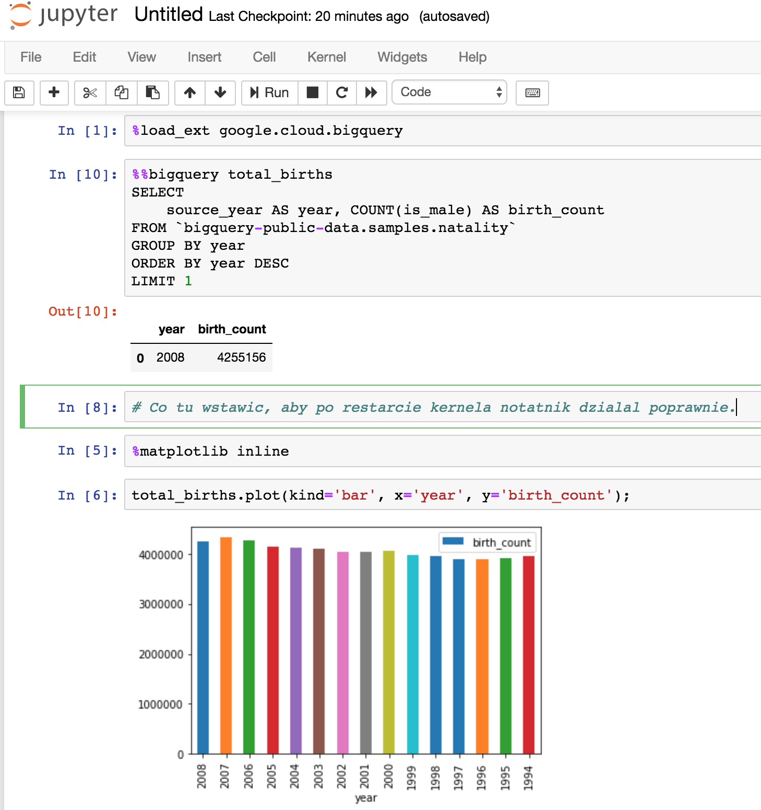

**Przygotowanie**

Aby wykonać zadanie musisz:
- założyć bezpłatne konto w GCP. 
- w sekcji `IAM >> Service accounts` utwórz konto z uprawnieniami `BigQuery Job User` oraz `BigQuery Data Viewer`
- dla tego konta pobierz klucz dostępu
- wykonaj *tylko* poniższe komendy
```
virtualenv env
source env/bin/activate

pip install --upgrade google-cloud-bigquery[pandas]
pip install jupyter
export GOOGLE_APPLICATION_CREDENTIALS="<Sciezka do pobranego klucza>"
jupyter notebook
```
Utwórz notatnik zgodnie z instrukcją z [Google Cloud](https://cloud.google.com/bigquery/docs/visualize-jupyter). Otrzymasz poniższy widok:



**Pytanie**

Co należy umieścić w komórce z komentarzem, aby notatnik poprawnie wyświetlił wykres.
