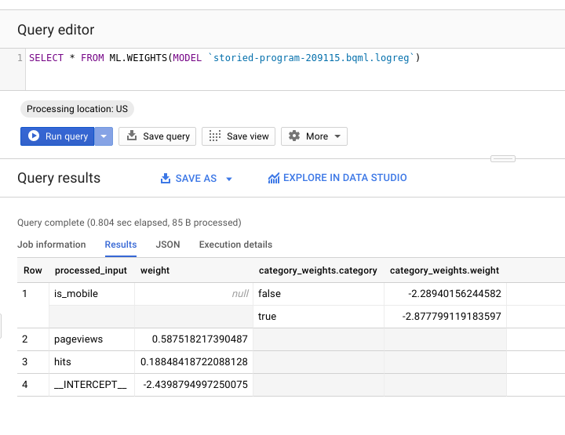

**Cel**

Twoim celem jest interpretacja modelu regresji logistycznej. 

**Opis**

Model prognozuje czy użytkownik dokona tranzakcji w sklepie internetowym. Zmiennymi objaśniającymi są rodzaj urządzenia, liczba odwiedzonych stron oraz liczba wykonanych akcji.

**Budowa modelu**

Model jest zbudowany w Google BigQuery przy pomocy komendy:

```
#standardSQL
CREATE MODEL `bqml.logreg`
OPTIONS(model_type='logistic_reg') AS
SELECT
  IF(totals.transactions IS NULL, 0, 1) AS label,
  device.isMobile AS is_mobile,
  IFNULL(totals.pageviews, 0) AS pageviews,
  IFNULL(totals.hits, 0) AS hits
FROM
  `bigquery-public-data.google_analytics_sample.ga_sessions_*`
WHERE  _TABLE_SUFFIX BETWEEN '20160801' AND '20170630'
```

Współczynniki są wyświetlone przy pomocy:

```
SELECT * FROM ML.WEIGHTS(MODEL `<nazwa_projektu>.bqml.logreg`)
```

Wynik komendy:



**Zadanie**

Zinterpretuj proszę współczynniki modelu. Czy według Ciebie jest to dobry model? Z czego mogą wynikać potencjalne problemy?

**Wskazówki**

Łatwiej Ci będzie debugować zapytanie SQL, gdy będziesz to robić z poziomu konsoli BigQuery GCP. W tym celu musisz założyć bezpłatne konto na Google Cloud Platform [GCP](https://cloud.google.com/).
