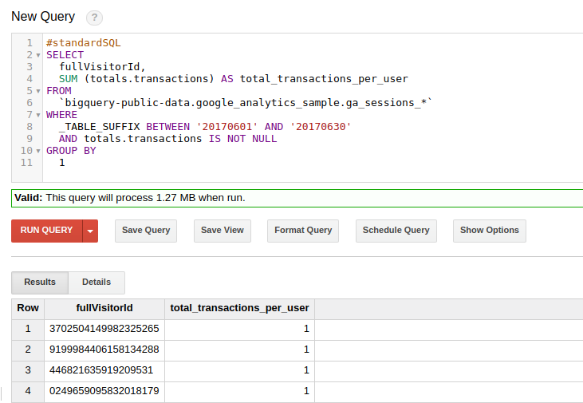
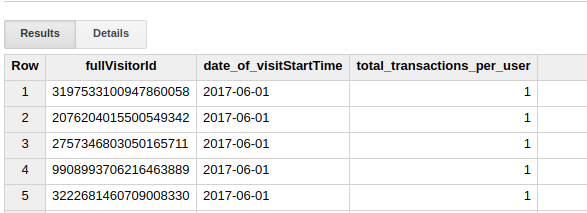

### Zadanie SQL 1

**Cel**

Twoim zadaniem jest napisanie zapytania SQL w bazie BigQuery na danych Google Analytics. 

**Wprowadzenie**

Poniżej jest przykład zapytania liczącego łączne przychody na użytkownika w czerwcu 2016. W zapytaniu korzystamy z publicznie dostępnego zbioru danych Google Analytics.

```
#standardSQL
SELECT
  fullVisitorId,
  SUM (totals.transactions) AS total_transactions_per_user
FROM
  `bigquery-public-data.google_analytics_sample.ga_sessions_*`
WHERE
  _TABLE_SUFFIX BETWEEN '20170601' AND '20170630'
  AND totals.transactions IS NOT NULL
GROUP BY
  1
```
Wynik wygląda tak:



**Zadanie**

Zmodyfikuje zapytanie tak, aby przychody zostały rozbite ze względu na dzień, w którym rozpoczęła się wizyta na stronie (visitStartTime). Czyli oczekujemy wyniku o strukturze jak poniżej:



**Wskazówki**

Łatwiej Ci będzie debugować zapytanie SQL, gdy będziesz to robić z poziomu konsoli BigQuery GCP. W tym celu musisz założyć bezpłatne konto na Google Cloud Platform [GCP](https://cloud.google.com/).
